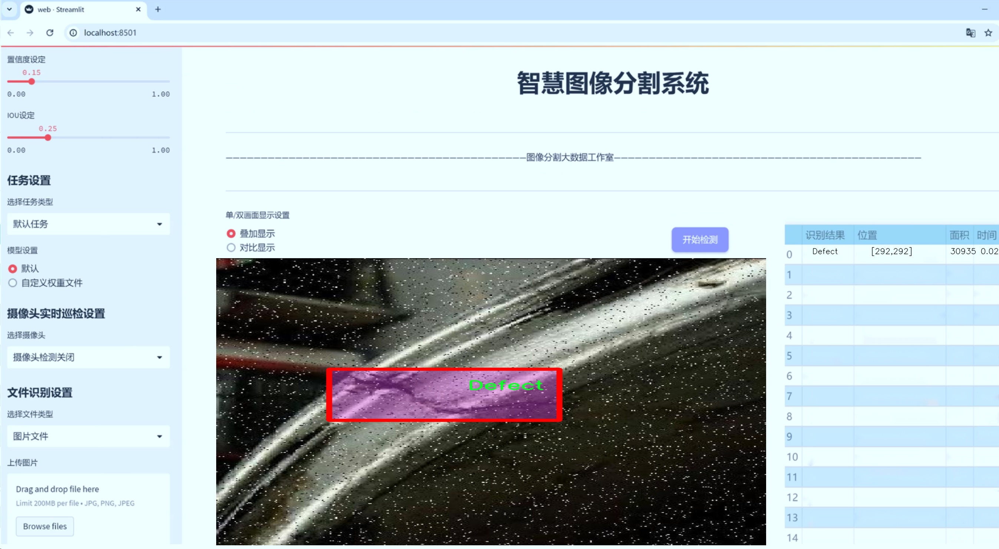
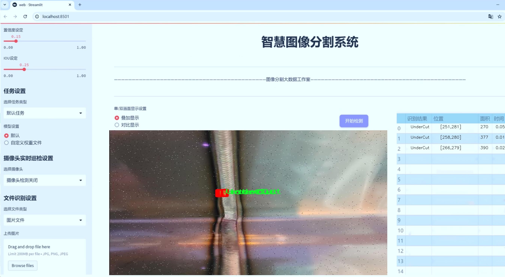
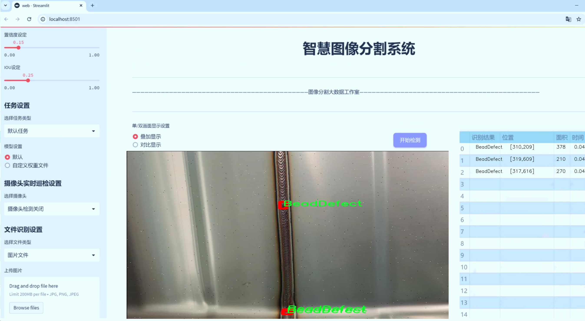
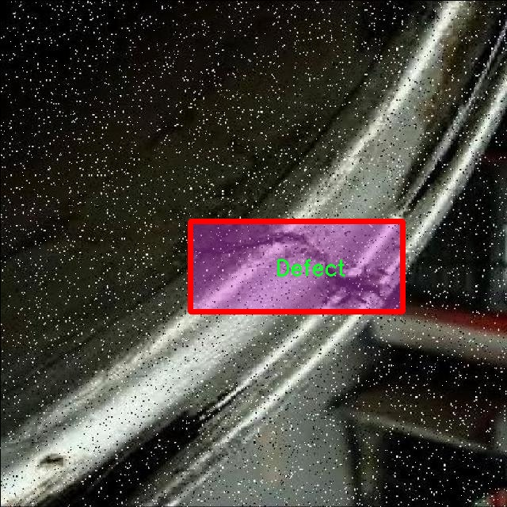
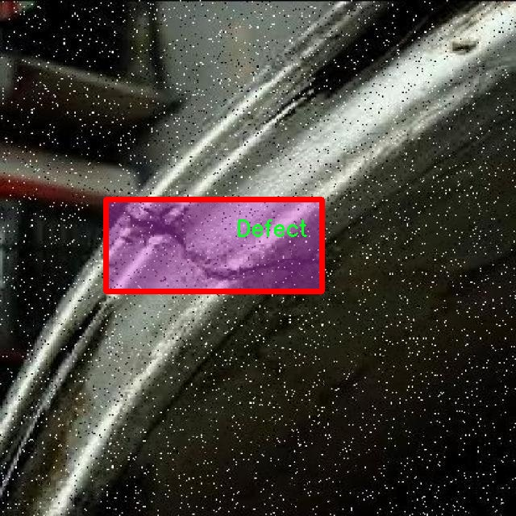
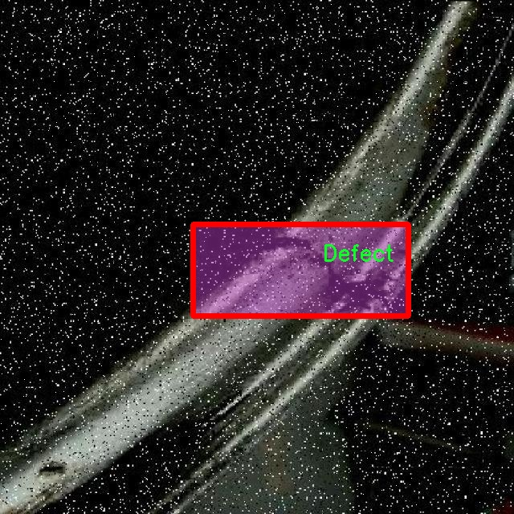
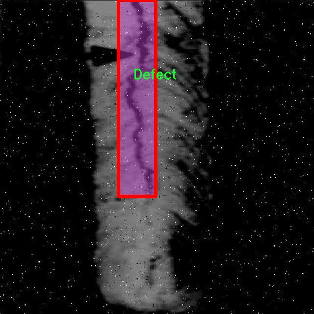

# 焊接缺陷分割系统源码＆数据集分享
 [yolov8-seg-C2f-DiverseBranchBlock＆yolov8-seg-C2f-DCNV3等50+全套改进创新点发刊_一键训练教程_Web前端展示]

### 1.研究背景与意义

项目参考[ILSVRC ImageNet Large Scale Visual Recognition Challenge](https://gitee.com/YOLOv8_YOLOv11_Segmentation_Studio/projects)

项目来源[AAAI Global Al lnnovation Contest](https://kdocs.cn/l/cszuIiCKVNis)

研究背景与意义

焊接作为现代制造业中不可或缺的重要工艺，其质量直接影响到产品的安全性和可靠性。随着工业技术的不断进步，焊接工艺的复杂性和多样性日益增加，焊接缺陷的种类也愈加繁多，主要包括焊接不良、焊缝缺陷、气孔、飞溅等。这些缺陷不仅会导致焊接接头的强度降低，还可能引发更为严重的安全隐患。因此，及时、准确地检测和分类焊接缺陷，对于提高焊接质量、保障产品安全具有重要的现实意义。

传统的焊接缺陷检测方法多依赖人工检查和经验判断，这不仅效率低下，而且容易受到主观因素的影响，导致漏检和误判。随着计算机视觉和深度学习技术的快速发展，基于图像处理的自动化焊接缺陷检测系统逐渐成为研究热点。尤其是YOLO（You Only Look Once）系列目标检测算法，以其高效的实时检测能力和较高的准确率，成为焊接缺陷检测领域的重要工具。然而，现有的YOLOv8模型在处理焊接缺陷分割任务时，仍存在一定的局限性，如对小目标的检测能力不足、背景复杂情况下的分割精度不高等问题。因此，针对YOLOv8模型进行改进，以提升其在焊接缺陷分割任务中的表现，具有重要的学术价值和应用前景。

本研究基于改进YOLOv8的焊接缺陷分割系统，利用一个包含2300幅图像的焊接缺陷数据集进行训练和验证。该数据集涵盖了8种焊接缺陷类别，包括不良焊接、焊缝缺陷、气孔、飞溅等，能够为模型提供丰富的样本数据。这些类别的划分不仅有助于提高模型的分类精度，还能为后续的焊接质量评估提供更为细致的依据。通过对数据集的深入分析和处理，我们可以有效地增强模型对不同类型焊接缺陷的识别能力，从而实现更为精准的缺陷分割。

在研究意义方面，改进YOLOv8的焊接缺陷分割系统将为焊接行业提供一种高效、自动化的缺陷检测解决方案，显著提升焊接质量控制的效率和准确性。同时，该系统的研究成果也将为其他领域的缺陷检测提供借鉴，推动计算机视觉技术在工业检测中的应用。此外，随着智能制造和工业4.0的不断发展，基于深度学习的自动化检测系统将成为未来制造业的重要组成部分。本研究不仅有助于推动焊接检测技术的进步，也为相关领域的研究提供了新的思路和方法，具有广泛的应用前景和深远的社会意义。

### 2.图片演示







##### 注意：由于此博客编辑较早，上面“2.图片演示”和“3.视频演示”展示的系统图片或者视频可能为老版本，新版本在老版本的基础上升级如下：（实际效果以升级的新版本为准）

  （1）适配了YOLOV8的“目标检测”模型和“实例分割”模型，通过加载相应的权重（.pt）文件即可自适应加载模型。

  （2）支持“图片识别”、“视频识别”、“摄像头实时识别”三种识别模式。

  （3）支持“图片识别”、“视频识别”、“摄像头实时识别”三种识别结果保存导出，解决手动导出（容易卡顿出现爆内存）存在的问题，识别完自动保存结果并导出到tempDir中。

  （4）支持Web前端系统中的标题、背景图等自定义修改，后面提供修改教程。

  另外本项目提供训练的数据集和训练教程,暂不提供权重文件（best.pt）,需要您按照教程进行训练后实现图片演示和Web前端界面演示的效果。

### 3.视频演示

[3.1 视频演示](https://www.bilibili.com/video/BV1TE2JYxEXB/)

### 4.数据集信息展示

##### 4.1 本项目数据集详细数据（类别数＆类别名）

nc: 8
names: ['Bad Weld', 'BeadDefect', 'BlowHole', 'Defect', 'Good Weld', 'OverCurrent', 'Spatter', 'UnderCut']


##### 4.2 本项目数据集信息介绍

数据集信息展示

在焊接领域，焊接缺陷的检测与分割是确保产品质量和安全性的重要环节。为此，我们构建了一个名为“Weld”的数据集，旨在为改进YOLOv8-seg的焊接缺陷分割系统提供丰富的训练数据。该数据集包含8个类别，涵盖了焊接过程中可能出现的各种缺陷和良好的焊接状态，具体类别包括“Bad Weld”（不良焊接）、“BeadDefect”（焊缝缺陷）、“BlowHole”（气孔）、“Defect”（缺陷）、“Good Weld”（良好焊接）、“OverCurrent”（过电流）、“Spatter”（飞溅）和“UnderCut”（切割不足）。

“Weld”数据集的构建基于广泛的焊接场景和实际应用，确保了数据的多样性和代表性。每个类别的样本均经过精心挑选和标注，旨在涵盖不同的焊接工艺、材料和环境条件。通过这种方式，我们不仅能够捕捉到焊接过程中常见的缺陷类型，还能为模型提供丰富的背景信息，以便更好地进行分割和识别。

在数据集的构建过程中，我们特别关注了样本的质量和多样性。每个类别的图像均经过严格筛选，确保其清晰度和标注的准确性。为了增强模型的鲁棒性，我们还引入了数据增强技术，包括旋转、缩放、翻转和亮度调整等，进一步丰富了训练数据的多样性。这种方法不仅提高了模型对不同焊接缺陷的识别能力，也使其在实际应用中能够更好地适应各种复杂的焊接环境。

此外，数据集的设计也考虑到了实际应用中的需求。例如，在工业生产中，良好的焊接状态与不良焊接状态的比例通常是一个关键指标。为此，我们在数据集中确保了“Good Weld”和“Bad Weld”类别样本的合理比例，以便模型能够有效学习到良好焊接与缺陷焊接之间的差异。这种平衡不仅有助于提高模型的分类准确性，也为后续的缺陷检测和分割提供了坚实的基础。

“Weld”数据集的发布，旨在推动焊接缺陷检测技术的发展，特别是在深度学习和计算机视觉领域的应用。通过利用YOLOv8-seg模型的强大能力，我们希望能够实现对焊接缺陷的高效、准确分割，从而为焊接质量的自动检测提供有力支持。随着数据集的不断完善和模型的持续优化，我们相信，焊接缺陷检测的自动化水平将会显著提升，为工业生产的安全性和可靠性提供更为坚实的保障。

总之，“Weld”数据集不仅是一个焊接缺陷检测与分割研究的重要资源，更是推动焊接技术进步的关键环节。通过对焊接缺陷的深入分析和研究，我们期待能够为焊接行业带来更高的质量标准和更低的缺陷率，最终实现更为安全和高效的生产过程。










### 5.全套项目环境部署视频教程（零基础手把手教学）

[5.1 环境部署教程链接（零基础手把手教学）](https://www.bilibili.com/video/BV1jG4Ve4E9t/?vd_source=bc9aec86d164b67a7004b996143742dc)


[5.2 安装Python虚拟环境创建和依赖库安装视频教程链接（零基础手把手教学）](https://www.bilibili.com/video/BV1nA4VeYEze/?vd_source=bc9aec86d164b67a7004b996143742dc)

### 6.手把手YOLOV8-seg训练视频教程（零基础小白有手就能学会）

[6.1 手把手YOLOV8-seg训练视频教程（零基础小白有手就能学会）](https://www.bilibili.com/video/BV1cA4VeYETe/?vd_source=bc9aec86d164b67a7004b996143742dc)


按照上面的训练视频教程链接加载项目提供的数据集，运行train.py即可开始训练



     Epoch   gpu_mem       box       obj       cls    labels  img_size
     1/200     0G   0.01576   0.01955  0.007536        22      1280: 100%|██████████| 849/849 [14:42<00:00,  1.04s/it]
               Class     Images     Labels          P          R     mAP@.5 mAP@.5:.95: 100%|██████████| 213/213 [01:14<00:00,  2.87it/s]
                 all       3395      17314      0.994      0.957      0.0957      0.0843

     Epoch   gpu_mem       box       obj       cls    labels  img_size
     2/200     0G   0.01578   0.01923  0.007006        22      1280: 100%|██████████| 849/849 [14:44<00:00,  1.04s/it]
               Class     Images     Labels          P          R     mAP@.5 mAP@.5:.95: 100%|██████████| 213/213 [01:12<00:00,  2.95it/s]
                 all       3395      17314      0.996      0.956      0.0957      0.0845

     Epoch   gpu_mem       box       obj       cls    labels  img_size
     3/200     0G   0.01561    0.0191  0.006895        27      1280: 100%|██████████| 849/849 [10:56<00:00,  1.29it/s]
               Class     Images     Labels          P          R     mAP@.5 mAP@.5:.95: 100%|███████   | 187/213 [00:52<00:00,  4.04it/s]
                 all       3395      17314      0.996      0.957      0.0957      0.0845


### 7.50+种全套YOLOV8-seg创新点代码加载调参视频教程（一键加载写好的改进模型的配置文件）

[7.1 50+种全套YOLOV8-seg创新点代码加载调参视频教程（一键加载写好的改进模型的配置文件）](https://www.bilibili.com/video/BV1Hw4VePEXv/?vd_source=bc9aec86d164b67a7004b996143742dc)

### 8.YOLOV8-seg图像分割算法原理

原始YOLOV8-seg算法原理

YOLOV8-seg算法是YOLO系列中的最新进展，旨在实现高效的目标检测与分割。该算法在设计上继承了YOLO系列的优良传统，同时结合了多种先进的技术与理念，以满足不同应用场景的需求。YOLOV8系列提供了五种不同规模的模型，包括n、s、m、l和x模型，分别适应于从轻量级到重型的多种任务。每种模型在缩放系数的调整上并非简单线性，而是通过改变主干网络的通道数来优化模型性能，从而实现更高的检测精度和速度。

YOLOV8的网络结构主要由输入层、主干网络、特征融合层和解耦头组成。以YOLOV8n为例，其网络结构在设计上采用了PAN-FPN（Path Aggregation Network - Feature Pyramid Network）结构，这一结构通过自下而上的特征融合方式，有效地结合了不同层次的特征信息，增强了模型对多尺度目标的检测能力。在此基础上，YOLOV8引入了C2f模块，这一模块在YOLOv5的C3模块基础上，结合了YOLOv7的ELAN模块的设计思想，增加了更多的残差连接，使得模型在保持轻量化的同时，能够获取更加丰富的梯度信息。

C2f模块的设计理念在于通过多条分支结构，增强特征的流动性与重用性。具体而言，C2f模块由多个CBS（卷积+归一化+激活）模块和Bottleneck构成，能够在深层网络中有效缓解梯度消失的问题，同时增强浅层特征的重用能力。通过对特征图进行多次的分支与合并，C2f模块不仅提升了特征提取的效率，还保证了输入输出特征图的尺寸一致性，从而在多尺度特征融合中发挥了重要作用。

在YOLOV8的Neck部分，采用了PAFPN结构，这一结构能够有效地完成多尺度信息的融合。通过自下而上的特征融合与自上而下的特征传递，YOLOV8实现了对浅层、中层和高层特征的深度融合，确保了每一层特征图都具备适当的分辨率和语义信息。这种设计使得YOLOV8在处理复杂场景时，能够更好地捕捉到目标的细节与语义特征，从而提升检测的准确性。

YOLOV8的Head部分采用了解耦合的结构，将分类与回归任务分开处理。与传统的Anchor-Based方法不同，YOLOV8采用了Anchor-Free的设计理念，简化了目标检测的过程。Head部分的输出特征图经过特定的处理后，能够直接生成目标的类别与边框信息，显著提高了检测的效率。此外，YOLOV8在损失函数的设计上也进行了创新，使用了BCELoss作为分类损失，DFLLoss与CIoULoss作为回归损失，这一组合有效地解决了样本不平衡问题，提高了模型的学习效果。

在数据增强方面，YOLOV8借鉴了YOLOv5的策略，采用了多种增强手段，如马赛克增强、混合增强、空间扰动和颜色扰动等。这些增强方法能够有效提升模型的鲁棒性，使其在面对复杂背景和多样化目标时，依然能够保持良好的检测性能。

YOLOV8的训练过程也引入了动态Task-Aligned Assigner样本分配策略，这一策略通过动态调整样本的分配方式，使得模型在训练过程中能够更好地适应不同的样本特性，从而提升整体的训练效率和效果。通过这些创新，YOLOV8不仅在目标检测任务中表现出色，还为后续的目标分割任务奠定了坚实的基础。

综上所述，YOLOV8-seg算法通过引入多种先进的技术与设计理念，在目标检测与分割领域达到了新的高度。其高效的网络结构、创新的模块设计、灵活的数据增强策略以及优化的损失函数，使得YOLOV8在实际应用中具备了更强的适应性与准确性。未来，随着技术的不断进步，YOLOV8-seg算法有望在更多领域中发挥重要作用，推动目标检测与分割技术的进一步发展。


### 9.系统功能展示（检测对象为举例，实际内容以本项目数据集为准）

图9.1.系统支持检测结果表格显示

  图9.2.系统支持置信度和IOU阈值手动调节

  图9.3.系统支持自定义加载权重文件best.pt(需要你通过步骤5中训练获得)

  图9.4.系统支持摄像头实时识别

  图9.5.系统支持图片识别

  图9.6.系统支持视频识别

  图9.7.系统支持识别结果文件自动保存

  图9.8.系统支持Excel导出检测结果数据


### 10.50+种全套YOLOV8-seg创新点原理讲解（非科班也可以轻松写刊发刊，V11版本正在科研待更新）

#### 10.1 由于篇幅限制，每个创新点的具体原理讲解就不一一展开，具体见下列网址中的创新点对应子项目的技术原理博客网址【Blog】：


[10.1 50+种全套YOLOV8-seg创新点原理讲解链接](https://gitee.com/qunmasj/good)

#### 10.2 部分改进模块原理讲解(完整的改进原理见上图和技术博客链接)【此小节的图要是加载失败请移步原始博客查看，链接：https://blog.csdn.net/cheng2333333?type=blog】
### YOLOv8简介
#### Yolov8网络模型
Yolov8n的网络分为输入端、主干网( Back-bone) 、Neck模块和输出端4个部分（图4)。输
人端主要有马赛克( Mosaic）数据增强、自适应锚框计算和自适应灰度填充。主干网有Conv、C2和SPPF结构，其中，C2r模块是对残差特征进行学习的主要模块，该模块仿照Yolov7的ELAN结构,通过更多的分支跨层连接，丰富了模型的梯度流，可形成一个具有更强特征表示能力的神经网络模
块。Neck模块采用PAN ( path aggregation nelwOrk ,结构，可加强网络对不同缩放尺度对象特征融合的
能力。输出端将分类和检测过程进行解耦，主要包括损失计算和目标检测框筛选，其中，损失计算过程主要包括正负样本分配策略和 Loss计算，Yolov8n 网络主要使用TaskAlignedAssignerl 10]方法，即根据分类与回归的分数加权结果选择正样本;Loss计算包括分类和回归2个分支，无Ob-jecIness分支。分类分支依然采用BCE Loss，回归分支则使用了Distribution Focal Loss!11〕和CIOU( complele inlersection over union)损失函数。

### 可扩张残差（DWR）注意力模块
当前的许多工作直接采用多速率深度扩张卷积从一个输入特征图中同时捕获多尺度上下文信息，从而提高实时语义分割的特征提取效率。 然而，这种设计可能会因为结构和超参数的不合理而导致多尺度上下文信息的访问困难。 为了降低绘制多尺度上下文信息的难度，我们提出了一种高效的多尺度特征提取方法，该方法分解了原始的单步特征提取方法方法分为两个步骤，区域残差-语义残差。 在该方法中，多速率深度扩张卷积在特征提取中发挥更简单的作用：根据第一步提供的每个简明区域形式特征图，在第二步中使用一个所需的感受野执行简单的基于语义的形态过滤 一步，提高他们的效率。 此外，扩张率和扩张卷积的容量每个网络阶段都经过精心设计，以充分利用所有可以实现的区域形式的特征图。 因此，我们分别为高层和低层网络设计了一种新颖的扩张式残差（DWR）模块和简单倒置残差（SIR）模块。


首先，该博客引入了一个Dilation-wise Residual（DWR）模块，用于提取网络高层的特征，如图2a所示。多分支结构用于扩展感受野，其中每个分支采用不同空洞率的空洞深度卷积。
然后，专门设计了一个Simple Inverted Residual（SIR）模块来提取网络低层的特征，如图2b所示。该模块仅具有3×3的微小感受野，但使用inverted bottleneck式结构来扩展通道数量，确保更强的特征提取能力。
最后，基于DWR和SIR模块，构建了一个编码器-解码器风格的网络DWRSeg，其中解码器采用了简单的类似FCN的结构。解码器使用来自最后两个阶段的强语义信息直接对特征图进行上采样，然后将它们与来自较低阶段的特征图（包含丰富的详细信息）拼接起来，以进行最终预测。


### 11.项目核心源码讲解（再也不用担心看不懂代码逻辑）

#### 11.1 ultralytics\hub\__init__.py

以下是经过简化和注释的核心代码部分：

```python
# 导入所需的库
import requests
from ultralytics.data.utils import HUBDatasetStats
from ultralytics.hub.auth import Auth
from ultralytics.hub.utils import HUB_API_ROOT, HUB_WEB_ROOT, PREFIX
from ultralytics.utils import LOGGER, SETTINGS

def login(api_key=''):
    """
    使用提供的API密钥登录Ultralytics HUB API。

    参数:
        api_key (str, optional): API密钥或组合API密钥和模型ID。

    示例:
        hub.login('API_KEY')
    """
    Auth(api_key, verbose=True)  # 调用Auth类进行登录

def logout():
    """
    从Ultralytics HUB注销，移除设置文件中的API密钥。
    """
    SETTINGS['api_key'] = ''  # 清空API密钥
    SETTINGS.save()  # 保存设置
    LOGGER.info(f"{PREFIX}logged out ✅. To log in again, use 'yolo hub login'.")  # 记录注销信息

def reset_model(model_id=''):
    """将训练好的模型重置为未训练状态。"""
    # 发送POST请求以重置模型
    r = requests.post(f'{HUB_API_ROOT}/model-reset', json={'apiKey': Auth().api_key, 'modelId': model_id})
    if r.status_code == 200:
        LOGGER.info(f'{PREFIX}Model reset successfully')  # 记录成功信息
    else:
        LOGGER.warning(f'{PREFIX}Model reset failure {r.status_code} {r.reason}')  # 记录失败信息

def export_fmts_hub():
    """返回HUB支持的导出格式列表。"""
    from ultralytics.engine.exporter import export_formats
    return list(export_formats()['Argument'][1:]) + ['ultralytics_tflite', 'ultralytics_coreml']  # 返回所有支持的格式

def export_model(model_id='', format='torchscript'):
    """将模型导出为指定格式。"""
    assert format in export_fmts_hub(), f"Unsupported export format '{format}'"  # 检查格式是否支持
    # 发送POST请求以导出模型
    r = requests.post(f'{HUB_API_ROOT}/v1/models/{model_id}/export',
                      json={'format': format},
                      headers={'x-api-key': Auth().api_key})
    assert r.status_code == 200, f'{PREFIX}{format} export failure {r.status_code} {r.reason}'  # 检查导出是否成功
    LOGGER.info(f'{PREFIX}{format} export started ✅')  # 记录导出开始信息

def check_dataset(path='', task='detect'):
    """
    在上传之前检查HUB数据集Zip文件的错误。

    参数:
        path (str, optional): 数据集Zip文件的路径。
        task (str, optional): 数据集任务类型，默认为'detect'。
    """
    HUBDatasetStats(path=path, task=task).get_json()  # 获取数据集统计信息
    LOGGER.info(f'Checks completed correctly ✅. Upload this dataset to {HUB_WEB_ROOT}/datasets/.')  # 记录检查完成信息
```

### 代码分析
1. **登录与注销功能**：`login`和`logout`函数分别用于用户登录和注销，管理API密钥的存储。
2. **模型重置**：`reset_model`函数允许用户将已训练的模型重置为未训练状态，适用于需要重新训练的场景。
3. **导出功能**：`export_fmts_hub`和`export_model`函数提供了模型导出的功能，支持多种格式的导出。
4. **数据集检查**：`check_dataset`函数用于在上传数据集之前检查其有效性，确保数据集格式正确且无错误。

这些功能构成了与Ultralytics HUB交互的核心部分，提供了模型管理和数据集处理的基本操作。

这个文件是Ultralytics YOLO项目的一部分，主要负责与Ultralytics HUB API进行交互，提供了一些用于登录、登出、模型重置、导出模型和检查数据集的功能。

首先，文件中导入了一些必要的模块和类，包括用于处理请求的`requests`库，以及Ultralytics库中的一些工具和设置。接下来，定义了一系列函数。

`login`函数用于通过提供的API密钥登录Ultralytics HUB API。用户可以传入API密钥或包含模型ID的组合密钥。登录成功后，用户可以使用该API进行后续操作。

`logout`函数则用于登出，主要是将API密钥从设置文件中移除。用户在登出后，可以通过调用`hub.login`重新登录。

`reset_model`函数允许用户将训练过的模型重置为未训练状态。它通过向HUB API发送POST请求来实现这一功能，并根据返回的状态码记录操作结果。

`export_fmts_hub`函数返回一个支持的导出格式列表，用户可以通过这个列表了解可以将模型导出为哪些格式。

`export_model`函数用于将指定的模型导出为用户选择的格式。它会检查所选格式是否受支持，并发送请求到HUB API进行导出。如果导出成功，记录相应的信息。

`get_export`函数用于获取已导出的模型的字典，其中包含下载链接。它同样会检查导出格式的有效性，并在请求成功后返回模型的相关信息。

最后，`check_dataset`函数用于在上传数据集到HUB之前进行错误检查。它会检查指定路径下的Zip文件（应包含一个`data.yaml`文件），确保数据集的完整性和正确性。检查完成后，用户会收到提示，可以将数据集上传到指定的HUB网站。

总体来说，这个文件提供了一系列与Ultralytics HUB交互的功能，帮助用户管理模型和数据集，简化了使用YOLO进行计算机视觉任务的流程。

#### 11.2 ui.py

```python
import sys
import subprocess

def run_script(script_path):
    """
    使用当前 Python 环境运行指定的脚本。

    Args:
        script_path (str): 要运行的脚本路径

    Returns:
        None
    """
    # 获取当前 Python 解释器的路径
    python_path = sys.executable

    # 构建运行命令
    command = f'"{python_path}" -m streamlit run "{script_path}"'

    # 执行命令
    result = subprocess.run(command, shell=True)
    if result.returncode != 0:
        print("脚本运行出错。")


# 实例化并运行应用
if __name__ == "__main__":
    # 指定您的脚本路径
    script_path = "web.py"  # 这里直接指定脚本路径

    # 运行脚本
    run_script(script_path)
```

### 代码注释

1. **导入模块**：
   - `import sys`：导入系统相关的模块，用于获取当前 Python 解释器的路径。
   - `import subprocess`：导入子进程模块，用于在 Python 中执行外部命令。

2. **定义函数 `run_script`**：
   - 该函数接收一个参数 `script_path`，表示要运行的 Python 脚本的路径。
   - 使用 `sys.executable` 获取当前 Python 解释器的路径，以确保在当前环境中运行脚本。
   - 构建一个命令字符串 `command`，使用 `streamlit` 模块运行指定的脚本。
   - 使用 `subprocess.run` 执行构建的命令，并检查返回码 `result.returncode`，如果不为 0，表示脚本运行出错，打印错误信息。

3. **主程序入口**：
   - `if __name__ == "__main__":`：确保只有在直接运行该脚本时才会执行以下代码。
   - 指定要运行的脚本路径 `script_path`，这里直接设置为 `"web.py"`。
   - 调用 `run_script(script_path)` 来运行指定的脚本。

这个程序文件的主要功能是通过当前的 Python 环境来运行一个指定的脚本，具体是一个名为 `web.py` 的文件。程序首先导入了必要的模块，包括 `sys`、`os` 和 `subprocess`，以及一个自定义的路径处理模块 `abs_path`。

在 `run_script` 函数中，首先获取当前 Python 解释器的路径，这样可以确保在正确的环境中运行脚本。接着，构建一个命令字符串，这个命令使用了 `streamlit` 这个库来运行指定的脚本。`streamlit` 是一个用于构建数据应用的框架，因此这里的 `web.py` 很可能是一个 Streamlit 应用。

随后，使用 `subprocess.run` 方法来执行这个命令。`shell=True` 参数允许在 shell 中执行命令，这样可以直接运行构建好的命令字符串。如果脚本运行出现错误，返回码将不为零，程序会打印出“脚本运行出错”的提示。

在文件的最后部分，使用 `if __name__ == "__main__":` 语句来确保只有在直接运行这个文件时才会执行下面的代码。这里指定了要运行的脚本路径，即通过 `abs_path` 函数获取的 `web.py` 的绝对路径，并调用 `run_script` 函数来执行这个脚本。

总体来说，这个程序的作用是提供一个简单的接口来运行一个 Streamlit 应用，确保在正确的 Python 环境中执行，并处理可能出现的错误。

#### 11.3 ultralytics\utils\callbacks\raytune.py

以下是经过简化和注释的核心代码部分：

```python
# 导入必要的库和模块
from ultralytics.utils import SETTINGS

# 尝试导入Ray库并验证Ray Tune集成是否启用
try:
    assert SETTINGS['raytune'] is True  # 检查Ray Tune集成是否启用
    import ray
    from ray import tune
    from ray.air import session
except (ImportError, AssertionError):
    tune = None  # 如果导入失败或集成未启用，则将tune设置为None

def on_fit_epoch_end(trainer):
    """在每个训练周期结束时，将训练指标发送到Ray Tune。"""
    if ray.tune.is_session_enabled():  # 检查Ray Tune会话是否启用
        metrics = trainer.metrics  # 获取当前训练指标
        metrics['epoch'] = trainer.epoch  # 将当前周期数添加到指标中
        session.report(metrics)  # 向Ray Tune报告指标

# 定义回调函数，如果tune可用，则包含on_fit_epoch_end回调
callbacks = {
    'on_fit_epoch_end': on_fit_epoch_end,
} if tune else {}
```

### 代码说明：
1. **导入设置**：从`ultralytics.utils`导入`SETTINGS`，用于检查Ray Tune的集成状态。
2. **集成验证**：使用`try`语句尝试导入Ray库，并通过`assert`语句检查`SETTINGS`中是否启用了Ray Tune。如果未启用或导入失败，则将`tune`设置为`None`。
3. **回调函数**：定义`on_fit_epoch_end`函数，该函数在每个训练周期结束时被调用，用于将训练指标发送到Ray Tune。
   - 检查Ray Tune会话是否启用。
   - 获取当前的训练指标，并将当前周期数添加到指标中。
   - 使用`session.report(metrics)`将指标报告给Ray Tune。
4. **回调字典**：根据`tune`的可用性定义回调字典`callbacks`，如果`tune`可用，则包含`on_fit_epoch_end`回调。

这个程序文件的主要功能是与Ray Tune集成，以便在训练过程中收集和报告训练指标。文件的开头包含了版权信息，表明该代码属于Ultralytics YOLO项目，并遵循AGPL-3.0许可证。

首先，代码从`ultralytics.utils`模块导入了`SETTINGS`，这是一个配置字典，用于存储各种设置。接着，代码尝试验证Ray Tune的集成是否启用，具体是通过检查`SETTINGS`字典中的`raytune`键是否为`True`。如果集成启用，代码将导入Ray库及其`tune`模块和`session`模块。如果导入失败或者集成未启用，则`tune`将被设置为`None`。

接下来，定义了一个名为`on_fit_epoch_end`的函数，该函数在每个训练周期结束时被调用。它的作用是将训练指标发送到Ray Tune。在函数内部，首先检查Ray Tune的会话是否已启用。如果启用，则从训练器（trainer）中获取当前的训练指标，并将当前的周期数（epoch）添加到指标中。最后，使用`session.report(metrics)`将这些指标报告给Ray Tune。

最后，代码构建了一个名为`callbacks`的字典，其中包含了一个键值对，键为`'on_fit_epoch_end'`，值为之前定义的`on_fit_epoch_end`函数。如果`tune`为`None`（即Ray Tune未启用），则`callbacks`字典将为空。这使得在训练过程中可以灵活地使用回调函数，只有在Ray Tune可用时才会使用相关的回调功能。

#### 11.4 ultralytics\utils\checks.py

以下是经过简化并注释的核心代码部分：

```python
import os
import re
import subprocess
from pathlib import Path
from typing import Optional

import torch
from ultralytics.utils import LOGGER, ROOT, SimpleNamespace, colorstr

def parse_requirements(file_path=ROOT.parent / 'requirements.txt', package=''):
    """
    解析 requirements.txt 文件，忽略以 '#' 开头的行和 '#' 后的文本。

    参数:
        file_path (Path): requirements.txt 文件的路径。
        package (str, optional): 用于替代 requirements.txt 文件的 Python 包名，例如 package='ultralytics'。

    返回:
        (List[Dict[str, str]]): 解析后的需求列表，每个需求以字典形式表示，包含 `name` 和 `specifier` 键。
    """
    # 如果指定了包名，则从包的元数据中获取依赖
    if package:
        requires = [x for x in metadata.distribution(package).requires if 'extra == ' not in x]
    else:
        requires = Path(file_path).read_text().splitlines()

    requirements = []
    for line in requires:
        line = line.strip()
        if line and not line.startswith('#'):
            line = line.split('#')[0].strip()  # 忽略行内注释
            match = re.match(r'([a-zA-Z0-9-_]+)\s*([<>!=~]+.*)?', line)
            if match:
                requirements.append(SimpleNamespace(name=match[1], specifier=match[2].strip() if match[2] else ''))

    return requirements


def check_version(current: str = '0.0.0', required: str = '0.0.0', name: str = 'version', hard: bool = False) -> bool:
    """
    检查当前版本是否满足所需版本或范围。

    参数:
        current (str): 当前版本或包名。
        required (str): 所需版本或范围（以 pip 风格格式）。
        name (str, optional): 用于警告消息的名称。
        hard (bool, optional): 如果为 True，当要求不满足时引发 AssertionError。

    返回:
        (bool): 如果满足要求则返回 True，否则返回 False。
    """
    if not current:  # 如果 current 是 '' 或 None
        LOGGER.warning(f'WARNING ⚠️ invalid check_version({current}, {required}) requested, please check values.')
        return True

    # 如果 required 是 '' 或 None，直接返回 True
    if not required:
        return True

    result = True
    c = parse_version(current)  # 将版本字符串解析为元组
    for r in required.strip(',').split(','):
        op, v = re.match(r'([^0-9]*)([\d.]+)', r).groups()  # 分离操作符和版本号
        v = parse_version(v)  # 将版本字符串解析为元组
        # 根据操作符检查版本
        if op == '==' and c != v:
            result = False
        elif op == '!=' and c == v:
            result = False
        elif op in ('>=', '') and not (c >= v):
            result = False
        elif op == '<=' and not (c <= v):
            result = False
        elif op == '>' and not (c > v):
            result = False
        elif op == '<' and not (c < v):
            result = False

    if not result:
        warning_message = f'WARNING ⚠️ {name}{op}{required} is required, but {name}=={current} is currently installed'
        if hard:
            raise ModuleNotFoundError(colorstr(warning_message))  # 如果要求不满足则引发异常
        LOGGER.warning(warning_message)
    return result


def check_python(minimum: str = '3.8.0') -> bool:
    """
    检查当前 Python 版本是否满足所需的最低版本。

    参数:
        minimum (str): 所需的最低 Python 版本。

    返回:
        None
    """
    return check_version(platform.python_version(), minimum, name='Python ', hard=True)


def check_file(file, suffix='', download=True, hard=True):
    """检查文件是否存在，如果不存在则下载，并返回文件路径。"""
    # 检查文件后缀
    check_suffix(file, suffix)  
    file = str(file).strip()  # 转换为字符串并去除空格
    if not file or Path(file).exists():  # 如果文件存在，直接返回
        return file
    elif download and file.lower().startswith(('https://', 'http://')):  # 如果是 URL，尝试下载
        url = file
        file = url2file(file)  # 将 URL 转换为文件路径
        if Path(file).exists():
            LOGGER.info(f'Found {url} locally at {file}')  # 文件已存在
        else:
            downloads.safe_download(url=url, file=file, unzip=False)  # 下载文件
        return file
    else:  # 搜索文件
        files = glob.glob(str(ROOT / '**' / file), recursive=True)  # 查找文件
        if not files and hard:
            raise FileNotFoundError(f"'{file}' does not exist")
        return files[0] if len(files) else []  # 返回找到的文件


def check_requirements(requirements=ROOT.parent / 'requirements.txt', exclude=(), install=True, cmds=''):
    """
    检查已安装的依赖项是否满足要求，并尝试自动更新。

    参数:
        requirements (Union[Path, str, List[str]]): requirements.txt 文件的路径，单个包要求字符串，或包要求字符串列表。
        exclude (Tuple[str]): 要排除的包名元组。
        install (bool): 如果为 True，尝试自动更新不满足要求的包。
        cmds (str): 自动更新时传递给 pip install 命令的附加命令。

    返回:
        (bool): 如果所有要求都满足则返回 True，否则返回 False。
    """
    check_python()  # 检查 Python 版本
    if isinstance(requirements, Path):  # 如果是 requirements.txt 文件
        file = requirements.resolve()
        assert file.exists(), f'requirements file {file} not found, check failed.'
        requirements = [f'{x.name}{x.specifier}' for x in parse_requirements(file) if x.name not in exclude]
    elif isinstance(requirements, str):
        requirements = [requirements]

    pkgs = []
    for r in requirements:
        r_stripped = r.split('/')[-1].replace('.git', '')  # 处理 Git URL
        match = re.match(r'([a-zA-Z0-9-_]+)([<>!=~]+.*)?', r_stripped)
        name, required = match[1], match[2].strip() if match[2] else ''
        try:
            assert check_version(metadata.version(name), required)  # 检查版本
        except (AssertionError, metadata.PackageNotFoundError):
            pkgs.append(r)

    if pkgs and install:  # 如果有未满足的包并且允许安装
        n = len(pkgs)  # 更新的包数量
        LOGGER.info(f"Ultralytics requirements {pkgs} not found, attempting AutoUpdate...")
        try:
            assert is_online(), 'AutoUpdate skipped (offline)'
            subprocess.check_output(f'pip install --no-cache {" ".join(pkgs)} {cmds}', shell=True)  # 自动更新
            LOGGER.info(f"AutoUpdate success ✅, installed {n} packages: {pkgs}")
        except Exception as e:
            LOGGER.warning(f'AutoUpdate failed ❌: {e}')
            return False

    return True
```

### 代码注释说明：
1. **parse_requirements**: 解析 requirements.txt 文件，提取出需要的包及其版本要求。
2. **check_version**: 检查当前版本是否满足所需版本的要求。
3. **check_python**: 检查当前 Python 版本是否满足最低要求。
4. **check_file**: 检查文件是否存在，如果不存在则下载。
5. **check_requirements**: 检查依赖项是否满足要求，并尝试自动更新。

这些函数是实现依赖管理和版本检查的核心部分，对于确保环境的正确性和完整性至关重要。

这个程序文件 `ultralytics/utils/checks.py` 是 Ultralytics YOLO 项目的一部分，主要用于检查和验证环境设置、依赖项和配置，以确保 YOLO 模型能够正常运行。文件中包含多个函数，每个函数的功能都与环境检查、版本解析、依赖管理等相关。

首先，文件导入了一系列必要的库，包括标准库和第三方库，如 `cv2`、`numpy`、`requests` 和 `torch`，这些库提供了图像处理、数值计算、HTTP 请求和深度学习等功能。

`parse_requirements` 函数用于解析 `requirements.txt` 文件，提取出所需的 Python 包及其版本信息。它会忽略以 `#` 开头的注释行，并将每一行解析为一个字典，包含包名和版本规范。

`parse_version` 函数将版本字符串转换为整数元组，方便进行版本比较。它能够处理类似 `2.0.1+cpu` 的字符串，并提取出主要的版本号。

`is_ascii` 函数检查一个字符串是否仅由 ASCII 字符组成，返回布尔值。

`check_imgsz` 函数验证图像尺寸是否为给定步幅的倍数，并在必要时进行调整，以确保图像尺寸符合模型的要求。

`check_version` 函数用于检查当前版本是否满足所需版本的要求。它支持多种比较操作符，并可以根据需要抛出异常或打印警告信息。

`check_latest_pypi_version` 函数通过访问 PyPI 获取指定包的最新版本信息，而 `check_pip_update_available` 函数则检查当前安装的 `ultralytics` 包是否有可用的更新。

`check_font` 函数用于查找本地字体，如果找不到，则从指定 URL 下载字体到用户配置目录。

`check_python` 函数检查当前 Python 版本是否满足最低要求。

`check_requirements` 函数检查安装的依赖项是否符合 YOLOv8 的要求，并在需要时尝试自动更新缺失的包。

`check_torchvision` 函数检查安装的 PyTorch 和 Torchvision 版本是否兼容，并给出相应的警告。

`check_suffix` 和 `check_yolov5u_filename` 函数用于检查文件后缀和更新 YOLOv5 文件名，以确保文件符合预期格式。

`check_file` 和 `check_yaml` 函数用于查找或下载指定的文件，确保文件存在并具有正确的后缀。

`check_imshow` 函数检查当前环境是否支持图像显示，`check_yolo` 函数则返回 YOLO 软件和硬件的摘要信息。

`collect_system_info` 函数收集并打印系统相关信息，包括操作系统、Python 版本、内存、CPU 和 CUDA 信息。

`check_amp` 函数检查 PyTorch 的自动混合精度功能是否正常工作，以避免训练过程中出现 NaN 损失或零 mAP 结果。

`git_describe` 函数返回 Git 描述信息，提供当前版本的可读性描述。

`print_args` 函数用于打印函数参数，便于调试。

`cuda_device_count` 和 `cuda_is_available` 函数用于检查可用的 NVIDIA GPU 数量和 CUDA 是否可用。

整体来看，这个文件提供了一系列实用的工具函数，帮助开发者确保环境配置正确，依赖项齐全，从而顺利运行 YOLO 模型。

#### 11.5 ultralytics\utils\callbacks\base.py

以下是经过简化和注释的核心代码部分，主要包含回调函数的定义和默认回调字典的创建：

```python
# Ultralytics YOLO 🚀, AGPL-3.0 license
"""基础回调函数定义。"""

from collections import defaultdict
from copy import deepcopy

# 定义训练过程中的回调函数

def on_train_start(trainer):
    """训练开始时调用的回调函数。"""
    pass

def on_train_epoch_start(trainer):
    """每个训练周期开始时调用的回调函数。"""
    pass

def on_train_batch_start(trainer):
    """每个训练批次开始时调用的回调函数。"""
    pass

def on_train_batch_end(trainer):
    """每个训练批次结束时调用的回调函数。"""
    pass

def on_train_epoch_end(trainer):
    """每个训练周期结束时调用的回调函数。"""
    pass

def on_train_end(trainer):
    """训练结束时调用的回调函数。"""
    pass

# 默认回调字典，包含训练过程中的各个回调函数
default_callbacks = {
    'on_train_start': [on_train_start],
    'on_train_epoch_start': [on_train_epoch_start],
    'on_train_batch_start': [on_train_batch_start],
    'on_train_batch_end': [on_train_batch_end],
    'on_train_epoch_end': [on_train_epoch_end],
    'on_train_end': [on_train_end],
}

def get_default_callbacks():
    """
    返回一个默认回调字典的副本，字典的值为默认空列表。

    返回:
        (defaultdict): 一个包含默认回调的defaultdict，默认值为空列表。
    """
    return defaultdict(list, deepcopy(default_callbacks))

def add_integration_callbacks(instance):
    """
    将来自不同来源的集成回调添加到实例的回调中。

    参数:
        instance (Trainer, Predictor, Validator, Exporter): 一个具有'callbacks'属性的对象，该属性是一个回调列表的字典。
    """
    # 加载其他回调
    from .hub import callbacks as hub_cb
    callbacks_list = [hub_cb]

    # 如果实例是Trainer类型，加载训练相关的回调
    if 'Trainer' in instance.__class__.__name__:
        from .clearml import callbacks as clear_cb
        from .comet import callbacks as comet_cb
        from .dvc import callbacks as dvc_cb
        from .mlflow import callbacks as mlflow_cb
        from .neptune import callbacks as neptune_cb
        from .raytune import callbacks as tune_cb
        from .tensorboard import callbacks as tb_cb
        from .wb import callbacks as wb_cb
        callbacks_list.extend([clear_cb, comet_cb, dvc_cb, mlflow_cb, neptune_cb, tune_cb, tb_cb, wb_cb])

    # 将回调添加到实例的回调字典中
    for callbacks in callbacks_list:
        for k, v in callbacks.items():
            if v not in instance.callbacks[k]:
                instance.callbacks[k].append(v)
```

### 代码说明：
1. **回调函数**：定义了一系列回调函数，用于在训练过程的不同阶段（如开始、每个周期、每个批次结束等）执行特定操作。当前实现中这些函数都是空的，实际使用时可以根据需要填充具体逻辑。
  
2. **默认回调字典**：`default_callbacks`字典包含了所有定义的回调函数，便于在训练过程中统一管理和调用。

3. **获取默认回调**：`get_default_callbacks`函数返回一个包含默认回调的字典，确保每个回调的初始值为一个空列表。

4. **添加集成回调**：`add_integration_callbacks`函数允许将来自不同库的回调集成到指定实例的回调字典中，便于扩展和使用。

这个程序文件 `ultralytics/utils/callbacks/base.py` 是一个用于定义和管理回调函数的基础模块，主要用于训练、验证、预测和导出模型的不同阶段。回调函数是在特定事件发生时自动调用的函数，通常用于执行一些自定义操作，比如记录日志、调整学习率、保存模型等。

文件中首先导入了 `defaultdict` 和 `deepcopy`，前者用于创建一个字典，默认值为列表，后者用于深拷贝对象。

接下来，文件定义了一系列回调函数，这些函数分为四个主要部分：训练回调、验证回调、预测回调和导出回调。每个部分包含多个函数，每个函数都有特定的触发时机。例如，`on_train_start` 在训练开始时被调用，`on_train_epoch_end` 在每个训练周期结束时被调用，`on_val_start` 在验证开始时被调用，等等。这些函数目前都为空实现，意味着在调用时不会执行任何操作，但可以根据需要进行扩展。

在训练回调部分，除了基本的开始和结束回调外，还有一些特定的操作，比如在优化器更新参数时调用的 `optimizer_step`，以及在每个批次开始和结束时的回调。这些回调为训练过程提供了灵活性，可以在不同阶段插入自定义逻辑。

在验证、预测和导出部分，类似的回调函数也被定义，允许用户在这些阶段插入自定义逻辑。

文件的最后部分定义了一个 `default_callbacks` 字典，包含了所有的回调函数，便于在实际使用中快速访问。接着，定义了 `get_default_callbacks` 函数，该函数返回一个深拷贝的 `default_callbacks` 字典，确保在使用时不会修改原始字典。

最后，`add_integration_callbacks` 函数用于将来自不同来源的集成回调添加到实例的回调字典中。它会根据传入的实例类型（如 Trainer、Predictor、Validator、Exporter）加载相应的回调，并将它们添加到实例的回调列表中。这种设计使得回调系统具有很好的扩展性，用户可以根据需要集成不同的回调功能。

总体来说，这个文件为 Ultralytics YOLO 提供了一个灵活的回调机制，使得用户可以在模型训练、验证、预测和导出过程中自定义操作，提升了模型训练的可控性和可扩展性。

#### 11.6 train.py

以下是代码中最核心的部分，并附上详细的中文注释：

```python
import os
import torch
import yaml
from ultralytics import YOLO  # 导入YOLO模型

if __name__ == '__main__':  # 确保该模块被直接运行时才执行以下代码
    # 设置训练参数
    workers = 1  # 数据加载的工作进程数
    batch = 8  # 每个批次的样本数量
    device = "0" if torch.cuda.is_available() else "cpu"  # 判断是否使用GPU

    # 获取数据集的yaml配置文件的绝对路径
    data_path = abs_path(f'datasets/data/data.yaml', path_type='current')

    # 读取YAML文件，保持原有顺序
    with open(data_path, 'r') as file:
        data = yaml.load(file, Loader=yaml.FullLoader)

    # 修改YAML文件中的路径项
    if 'train' in data and 'val' in data and 'test' in data:
        directory_path = os.path.dirname(data_path.replace(os.sep, '/'))  # 获取目录路径
        data['train'] = directory_path + '/train'  # 更新训练集路径
        data['val'] = directory_path + '/val'      # 更新验证集路径
        data['test'] = directory_path + '/test'    # 更新测试集路径

        # 将修改后的数据写回YAML文件
        with open(data_path, 'w') as file:
            yaml.safe_dump(data, file, sort_keys=False)

    # 加载YOLO模型配置文件并加载预训练权重
    model = YOLO(r"C:\codeseg\codenew\50+种YOLOv8算法改进源码大全和调试加载训练教程（非必要）\改进YOLOv8模型配置文件\yolov8-seg-C2f-Faster.yaml").load("./weights/yolov8s-seg.pt")

    # 开始训练模型
    results = model.train(
        data=data_path,  # 指定训练数据的配置文件路径
        device=device,  # 使用指定的设备进行训练
        workers=workers,  # 指定使用的工作进程数
        imgsz=640,  # 输入图像的大小
        epochs=100,  # 训练的轮数
        batch=batch,  # 每个批次的样本数量
    )
```

### 代码注释说明：
1. **导入必要的库**：导入`os`用于文件路径操作，`torch`用于深度学习，`yaml`用于读取YAML文件，`YOLO`用于加载YOLO模型。
2. **主程序入口**：使用`if __name__ == '__main__':`确保代码块仅在直接运行时执行。
3. **设置训练参数**：定义数据加载的工作进程数、批次大小以及选择设备（GPU或CPU）。
4. **获取数据集路径**：通过`abs_path`函数获取数据集的YAML配置文件的绝对路径。
5. **读取和修改YAML文件**：读取YAML文件内容，更新训练、验证和测试集的路径，并将修改后的内容写回文件。
6. **加载YOLO模型**：指定YOLO模型的配置文件和预训练权重进行加载。
7. **训练模型**：调用`model.train`方法开始训练，传入数据路径、设备、工作进程数、图像大小、训练轮数和批次大小等参数。

这个程序文件 `train.py` 是用于训练 YOLO（You Only Look Once）模型的脚本，主要使用了 PyTorch 框架和 Ultralytics 提供的 YOLO 实现。程序的主要功能是加载数据集、配置模型，并开始训练。

首先，程序导入了必要的库，包括 `os`、`torch`、`yaml` 和 `matplotlib`。其中，`ultralytics` 是用于处理 YOLO 模型的库，`QtFusion.path` 提供了处理路径的功能。

在 `if __name__ == '__main__':` 语句下，程序开始执行主要逻辑。首先设置了一些训练参数，包括工作进程数 `workers`、批次大小 `batch`，并根据是否有可用的 GPU 来选择设备（`device`）。如果有可用的 GPU，设备设置为 "0"，否则设置为 "cpu"。

接下来，程序通过 `abs_path` 函数获取数据集配置文件 `data.yaml` 的绝对路径，并将路径中的分隔符统一为 Unix 风格。然后，使用 `os.path.dirname` 获取数据集的目录路径。

程序读取 `data.yaml` 文件，并将其内容加载到 `data` 变量中。此时，如果 YAML 文件中包含 `train`、`val` 和 `test` 三个键，程序会将它们的值修改为相应的训练、验证和测试数据的目录路径。修改完成后，程序将更新后的数据写回到 YAML 文件中。

在模型加载部分，程序指定了一个 YOLO 模型的配置文件路径，并加载了预训练的权重文件。这里可以选择不同的模型配置文件，用户可以根据自己的需求进行调整。

最后，程序调用 `model.train()` 方法开始训练模型。训练过程中，指定了数据配置文件的路径、设备、工作进程数、输入图像的大小（640x640）、训练的 epoch 数（100）以及每个批次的大小（8）。

整体来看，这个脚本的目的是为了方便用户在本地环境中快速配置和训练 YOLO 模型，适用于目标检测或图像分割等任务。用户可以根据自己的计算资源和数据集情况调整相关参数，以获得最佳的训练效果。

### 12.系统整体结构（节选）

### 整体功能和构架概括

Ultralytics YOLO 项目是一个用于目标检测和图像分割的深度学习框架，基于 PyTorch 实现。该项目的整体功能包括模型训练、验证、预测和导出等。其架构由多个模块和文件组成，每个文件负责特定的功能，形成一个协同工作的系统。

- **核心功能**：提供 YOLO 模型的训练、验证和推理能力，支持多种数据集格式和模型配置。
- **回调机制**：通过回调函数管理训练过程中的各种事件，允许用户自定义操作。
- **环境检查**：确保用户的环境配置正确，依赖项齐全，以避免运行时错误。
- **用户界面**：提供简单的用户界面和 API 接口，方便用户进行模型的训练和推理。

### 文件功能整理表

| 文件路径                                                   | 功能描述                                                                                       |
|----------------------------------------------------------|-----------------------------------------------------------------------------------------------|
| `ultralytics/hub/__init__.py`                           | 提供与 Ultralytics HUB API 交互的功能，包括登录、登出、模型重置、导出模型和检查数据集。        |
| `ui.py`                                                 | 运行一个 Streamlit 应用（`web.py`），提供用户界面以便于交互和可视化。                          |
| `ultralytics/utils/callbacks/raytune.py`               | 集成 Ray Tune，用于在训练过程中收集和报告训练指标。                                           |
| `ultralytics/utils/checks.py`                           | 提供环境检查和依赖项验证的功能，确保模型训练的环境配置正确。                                   |
| `ultralytics/utils/callbacks/base.py`                   | 定义和管理训练、验证、预测和导出过程中的回调函数，允许用户自定义操作。                        |
| `train.py`                                             | 主要训练脚本，负责加载数据集、配置模型并开始训练。                                            |
| `ultralytics/nn/backbone/convnextv2.py`                | 实现 ConvNeXt V2 网络结构，作为 YOLO 模型的骨干网络之一。                                     |
| `ultralytics/models/sam/model.py`                       | 实现 SAM（Segment Anything Model）模型的结构和功能。                                          |
| `ultralytics/nn/backbone/revcol.py`                    | 实现 RevCol 网络结构，作为 YOLO 模型的骨干网络之一。                                          |
| `ultralytics/models/yolo/classify/predict.py`          | 提供 YOLO 模型的分类预测功能。                                                                  |
| `ultralytics/nn/extra_modules/ops_dcnv3/functions/__init__.py` | 提供 DCNv3（Deformable Convolutional Networks V3）模块的初始化和功能实现。                   |
| `ultralytics/models/nas/model.py`                       | 实现神经架构搜索（NAS）模型的结构和功能。                                                      |
| `ultralytics/models/fastsam/__init__.py`                | 提供 FastSAM 模型的初始化和功能实现。                                                          |

这个表格总结了每个文件的主要功能，帮助理解 Ultralytics YOLO 项目的整体架构和模块化设计。

注意：由于此博客编辑较早，上面“11.项目核心源码讲解（再也不用担心看不懂代码逻辑）”中部分代码可能会优化升级，仅供参考学习，完整“训练源码”、“Web前端界面”和“50+种创新点源码”以“14.完整训练+Web前端界面+50+种创新点源码、数据集获取”的内容为准。

### 13.图片、视频、摄像头图像分割Demo(去除WebUI)代码

在这个博客小节中，我们将讨论如何在不使用WebUI的情况下，实现图像分割模型的使用。本项目代码已经优化整合，方便用户将分割功能嵌入自己的项目中。
核心功能包括图片、视频、摄像头图像的分割，ROI区域的轮廓提取、类别分类、周长计算、面积计算、圆度计算以及颜色提取等。
这些功能提供了良好的二次开发基础。

### 核心代码解读

以下是主要代码片段，我们会为每一块代码进行详细的批注解释：

```python
import random
import cv2
import numpy as np
from PIL import ImageFont, ImageDraw, Image
from hashlib import md5
from model import Web_Detector
from chinese_name_list import Label_list

# 根据名称生成颜色
def generate_color_based_on_name(name):
    ......

# 计算多边形面积
def calculate_polygon_area(points):
    return cv2.contourArea(points.astype(np.float32))

...
# 绘制中文标签
def draw_with_chinese(image, text, position, font_size=20, color=(255, 0, 0)):
    image_pil = Image.fromarray(cv2.cvtColor(image, cv2.COLOR_BGR2RGB))
    draw = ImageDraw.Draw(image_pil)
    font = ImageFont.truetype("simsun.ttc", font_size, encoding="unic")
    draw.text(position, text, font=font, fill=color)
    return cv2.cvtColor(np.array(image_pil), cv2.COLOR_RGB2BGR)

# 动态调整参数
def adjust_parameter(image_size, base_size=1000):
    max_size = max(image_size)
    return max_size / base_size

# 绘制检测结果
def draw_detections(image, info, alpha=0.2):
    name, bbox, conf, cls_id, mask = info['class_name'], info['bbox'], info['score'], info['class_id'], info['mask']
    adjust_param = adjust_parameter(image.shape[:2])
    spacing = int(20 * adjust_param)

    if mask is None:
        x1, y1, x2, y2 = bbox
        aim_frame_area = (x2 - x1) * (y2 - y1)
        cv2.rectangle(image, (x1, y1), (x2, y2), color=(0, 0, 255), thickness=int(3 * adjust_param))
        image = draw_with_chinese(image, name, (x1, y1 - int(30 * adjust_param)), font_size=int(35 * adjust_param))
        y_offset = int(50 * adjust_param)  # 类别名称上方绘制，其下方留出空间
    else:
        mask_points = np.concatenate(mask)
        aim_frame_area = calculate_polygon_area(mask_points)
        mask_color = generate_color_based_on_name(name)
        try:
            overlay = image.copy()
            cv2.fillPoly(overlay, [mask_points.astype(np.int32)], mask_color)
            image = cv2.addWeighted(overlay, 0.3, image, 0.7, 0)
            cv2.drawContours(image, [mask_points.astype(np.int32)], -1, (0, 0, 255), thickness=int(8 * adjust_param))

            # 计算面积、周长、圆度
            area = cv2.contourArea(mask_points.astype(np.int32))
            perimeter = cv2.arcLength(mask_points.astype(np.int32), True)
            ......

            # 计算色彩
            mask = np.zeros(image.shape[:2], dtype=np.uint8)
            cv2.drawContours(mask, [mask_points.astype(np.int32)], -1, 255, -1)
            color_points = cv2.findNonZero(mask)
            ......

            # 绘制类别名称
            x, y = np.min(mask_points, axis=0).astype(int)
            image = draw_with_chinese(image, name, (x, y - int(30 * adjust_param)), font_size=int(35 * adjust_param))
            y_offset = int(50 * adjust_param)

            # 绘制面积、周长、圆度和色彩值
            metrics = [("Area", area), ("Perimeter", perimeter), ("Circularity", circularity), ("Color", color_str)]
            for idx, (metric_name, metric_value) in enumerate(metrics):
                ......

    return image, aim_frame_area

# 处理每帧图像
def process_frame(model, image):
    pre_img = model.preprocess(image)
    pred = model.predict(pre_img)
    det = pred[0] if det is not None and len(det)
    if det:
        det_info = model.postprocess(pred)
        for info in det_info:
            image, _ = draw_detections(image, info)
    return image

if __name__ == "__main__":
    cls_name = Label_list
    model = Web_Detector()
    model.load_model("./weights/yolov8s-seg.pt")

    # 摄像头实时处理
    cap = cv2.VideoCapture(0)
    while cap.isOpened():
        ret, frame = cap.read()
        if not ret:
            break
        ......

    # 图片处理
    image_path = './icon/OIP.jpg'
    image = cv2.imread(image_path)
    if image is not None:
        processed_image = process_frame(model, image)
        ......

    # 视频处理
    video_path = ''  # 输入视频的路径
    cap = cv2.VideoCapture(video_path)
    while cap.isOpened():
        ret, frame = cap.read()
        ......
```


### 14.完整训练+Web前端界面+50+种创新点源码、数据集获取


# [下载链接：https://mbd.pub/o/bread/ZpyXlZ1p](https://mbd.pub/o/bread/ZpyXlZ1p)